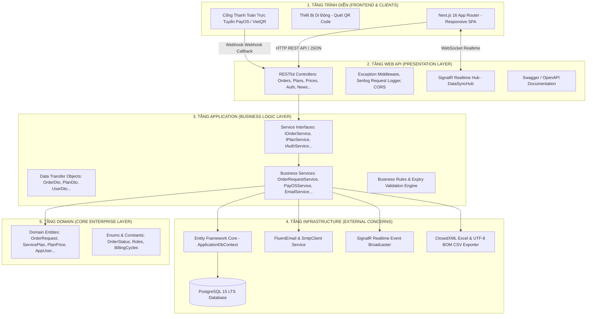
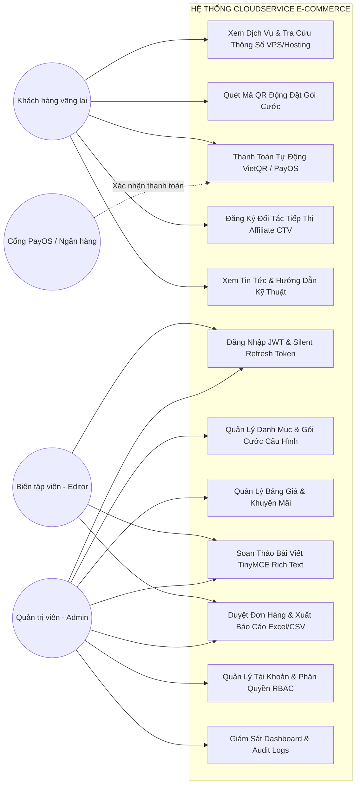
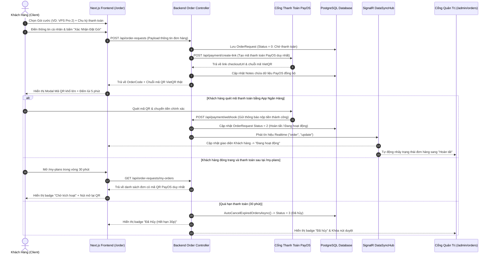
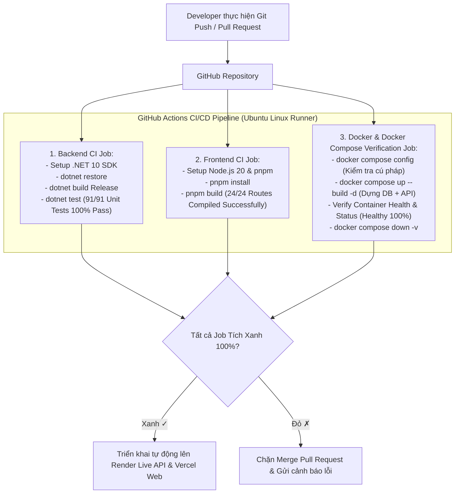

# SƠ ĐỒ THIẾT KẾ CƠ SỞ DỮ LIỆU & KIẾN TRÚC HỆ THỐNG CLOUDSERVICE

Tài liệu này chứa toàn bộ mã nguồn biểu đồ dạng **Mermaid Diagram** phục vụ cho Báo cáo Đồ án cuối kỳ môn **Phát triển phần mềm hướng đối tượng (IN4211)**. Bạn có thể xem trực tiếp trên GitHub, VS Code, hoặc sao chép mã vào [Mermaid Live Editor](https://mermaid.live) để xuất file ảnh chất lượng cao (PNG/SVG) chèn vào Word/Báo cáo.

---

## 1. Sơ Đồ Quan Hệ Thực Thể CSDL (Entity Relationship Diagram - ERD)

```mermaid
erDiagram
    SERVICE_CATEGORIES ||--o{ SERVICE_PLANS : "chứa (1 - N)"
    SERVICE_PLANS ||--o{ PLAN_PRICES : "có giá theo chu kỳ (1 - N)"
    PROMOTIONS ||--o{ PLAN_PRICES : "áp dụng giảm giá (1 - N)"
    PLAN_PRICES ||--o{ ORDER_REQUESTS : "được đặt mua (1 - N)"
    APP_ROLES ||--o{ APP_USERS : "phân quyền (1 - N)"
    APP_USERS ||--o{ NEWS_ARTICLES : "soạn thảo (1 - N)"
    APP_USERS ||--o{ AUDIT_LOGS : "ghi nhật ký hành vi (1 - N)"

    SERVICE_CATEGORIES {
        int Id PK "Khóa chính tự tăng"
        string Name "Tên danh mục (Cloud VPS, Hosting, Domain...)"
        string Slug "Đường dẫn định danh SEO (vps, hosting)"
        string Description "Mô tả chi tiết danh mục"
        string IconUrl "Đường dẫn biểu tượng icon"
        int DisplayOrder "Thứ tự hiển thị ngoài giao diện"
        bool IsActive "Trạng thái hoạt động (Soft delete)"
        datetime CreatedAt "Thời gian tạo bản ghi"
    }

    SERVICE_PLANS {
        int Id PK "Khóa chính tự tăng"
        int CategoryId FK "Khóa ngoại tham chiếu SERVICE_CATEGORIES"
        string Name "Tên gói cước (VPS Pro 1, Cloud Starter...)"
        string Slug "Đường dẫn định danh gói cước"
        string Description "Mô tả ngắn về cấu hình gói"
        string Cpu "Thông số vi xử lý (2 vCPU, 4 vCPU...)"
        string Ram "Dung lượng bộ nhớ RAM (4GB, 8GB DDR4...)"
        string Storage "Ổ cứng lưu trữ (50GB NVMe Gen4...)"
        string Bandwidth "Băng thông mạng (100Mbps, 1Gbps...)"
        string QrCodeUrl "URL mã QR động dẫn đến trang đặt gói"
        bool IsFeatured "Đánh dấu gói cước nổi bật trang chủ"
        bool IsActive "Trạng thái hoạt động (Soft delete)"
        datetime CreatedAt "Thời gian tạo bản ghi"
    }

    PLAN_PRICES {
        int Id PK "Khóa chính tự tăng"
        int PlanId FK "Khóa ngoại tham chiếu SERVICE_PLANS"
        int PromotionId FK "Khóa ngoại tham chiếu PROMOTIONS (Nullable)"
        string BillingCycle "Chu kỳ thanh toán (Tháng, Năm...)"
        decimal Price "Giá niêm yết chuẩn (VNĐ)"
        bool IsActive "Trạng thái hiệu lực của mức giá"
        datetime CreatedAt "Thời gian tạo bản ghi"
    }

    PROMOTIONS {
        int Id PK "Khóa chính tự tăng"
        string Name "Tên chương trình khuyến mãi (Sale Hè, Tết...)"
        decimal DiscountPercentage "Tỷ lệ chiết khấu giảm giá (0% - 100%)"
        datetime StartDate "Thời gian bắt đầu áp dụng"
        datetime EndDate "Thời gian kết thúc khuyến mãi"
        bool IsActive "Trạng thái kích hoạt"
        datetime CreatedAt "Thời gian tạo bản ghi"
    }

    ORDER_REQUESTS {
        int Id PK "Khóa chính tự tăng"
        int PlanPriceId FK "Khóa ngoại tham chiếu PLAN_PRICES"
        string CustomerName "Họ và tên khách hàng đặt mua"
        string CustomerEmail "Địa chỉ Email nhận thông tin bàn giao"
        string CustomerPhone "Số điện thoại liên hệ"
        string CompanyName "Tên công ty / Tổ chức (Tùy chọn)"
        int Status "Trạng thái đơn: 0-Mới, 1-Xử lý, 2-Hoàn tất, 3-Hủy"
        string Notes "Ghi chú, số tiền thanh toán, dữ liệu PayOS"
        bool IsActive "Trạng thái bản ghi"
        datetime CreatedAt "Thời gian tạo đơn (Khởi tạo chu kỳ 30p)"
    }

    APP_ROLES {
        int Id PK "Khóa chính tự tăng"
        string Name "Tên vai trò phân quyền: Admin, Editor, Customer"
        string Description "Mô tả phạm vi quyền hạn"
    }

    APP_USERS {
        int Id PK "Khóa chính tự tăng"
        int RoleId FK "Khóa ngoại tham chiếu APP_ROLES"
        string Username "Tên đăng nhập hệ thống (admin, editor...)"
        string PasswordHash "Mật khẩu băm chuẩn bảo mật BCrypt"
        string Email "Địa chỉ email tài khoản"
        string FullName "Họ và tên đầy đủ của người dùng"
        bool IsActive "Trạng thái tài khoản (Khóa / Mở)"
        datetime CreatedAt "Thời gian tạo tài khoản"
    }

    NEWS_ARTICLES {
        int Id PK "Khóa chính tự tăng"
        int AuthorId FK "Khóa ngoại tham chiếu APP_USERS"
        string Title "Tiêu đề bài viết tin tức / công nghệ"
        string Slug "Đường dẫn SEO của bài viết"
        string Summary "Đoạn tóm tắt nội dung hiển thị ở danh sách"
        string Content "Nội dung bài viết định dạng HTML Rich Text TinyMCE"
        string ThumbnailUrl "Đường dẫn ảnh bìa bài viết"
        string Category "Chuyên mục (Hướng dẫn, Tin tức, Khuyến mãi...)"
        bool IsPublished "Trạng thái xuất bản công khai"
        datetime CreatedAt "Thời gian xuất bản bài viết"
    }

    AFFILIATE_APPLICATIONS {
        int Id PK "Khóa chính tự tăng"
        string FullName "Họ tên người đăng ký làm cộng tác viên (CTV)"
        string Email "Địa chỉ email nhận đối soát hoa hồng"
        string Phone "Số điện thoại liên hệ của đối tác"
        string WebsiteUrl "Kênh truyền thông / Website / Fanpage tiếp thị"
        string Motivation "Kế hoạch quảng bá / Thông tin ngân hàng nhận tiền"
        int Status "Trạng thái duyệt: 1-Chờ duyệt, 2-Đã duyệt, 3-Từ chối"
        datetime CreatedAt "Thời gian gửi hồ sơ đăng ký"
    }

    AUDIT_LOGS {
        int Id PK "Khóa chính tự tăng"
        string Username "Tên người dùng thực hiện thao tác (Admin, Editor...)"
        string Action "Hành động (Đăng nhập, Sửa giá, Thêm gói, Hủy đơn...)"
        string EntityName "Đối tượng bị tác động (Plan, Price, Order, User)"
        string EntityId "ID của đối tượng bị tác động"
        string Payload "Chi tiết dữ liệu thay đổi / Thông số kỹ thuật"
        datetime Timestamp "Thời gian chính xác xảy ra hành vi"
    }

    TESTIMONIALS {
        int Id PK "Khóa chính tự tăng"
        string ClientName "Tên khách hàng / Giám đốc doanh nghiệp"
        string Company "Tên công ty / Tổ chức đánh giá dịch vụ"
        string Content "Nội dung nhận xét về chất lượng hạ tầng Cloud"
        int Rating "Số sao đánh giá (1 - 5 sao)"
        string AvatarUrl "Đường dẫn ảnh đại diện khách hàng"
        bool IsActive "Trạng thái cho phép hiển thị trang chủ"
    }
```

---

## 2. Sơ Đồ Kiến Trúc Clean Architecture 4 Tầng (.NET 10 Web API)

---

## 3. Sơ Đồ Use Case Tổng Quát Hệ Thống

---

## 4. Sơ Đồ Tuần Tự: Đặt Hàng & Thanh Toán Tự Động Bằng Mã QR (Sequence Diagram)

---

## 5. Sơ Đồ Pipeline CI/CD Tự Động (GitHub Actions Workflow)

